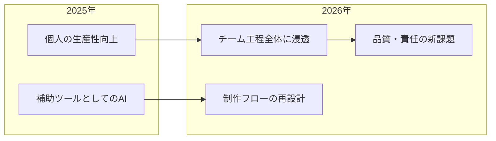
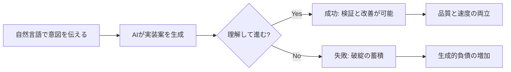
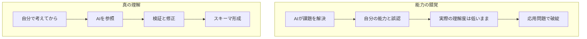

# AI技術の活用（ゲームとAI）2026

<!-- metadata: author=久留米大学, date=2026-01-08 -->

## 第1章 導入・問題提起

本講義の概要と、AI時代における人間の役割を整理する

---

## AI技術の活用（ゲームとAI）2026

- LLM時代の「作り方」と「人間の役割」を問い直す
- 生成AI/LLMがゲーム制作の現場に浸透した2026年
- 「作業効率化」から「工程の再設計」へシフト
- でもゲームの本体は「体験設計」であり続ける
- AI時代に価値を持つのは誰か？を構造的に整理する

---

## 本講義で使用するリンク・資料

- アンケート（好きなゲーム/AIツール経験）
- GitHub（サンプルコード/講義資料）
- デモ（Sample Game：実際に動くゲームAI）
- 本資料PDFリンク（後日配布）

---

## 自己紹介

- ゲーム技術・オンライン領域・AI活用の現場経験
- 講義の目的：現場感と基礎理論の橋渡し
- 今日は「技術紹介」より「構造理解」を優先
- 質問歓迎（途中でもOK）

---

## 2025→2026：この1年で何が変わったか

- LLMが「一部の人の道具」から「普通の道具」へ
- 個人制作だけでなく、チーム工程にも浸透
- 企画→実装→テスト→運用の速度が上がった
- でも品質と責任の課題も増えた
- GitHub Copilot、ChatGPT、Claudeが日常化

---

## 生成AIとLLMの社会的浸透

- 文章/画像/コードの生成が日常化
- 「検索」ではなく「生成」が入口になる場面が増加
- 使える人と使えない人の差が拡大
- その差は知識量ではなく「思考の型」で決まる
- プロンプトの上手さ ≠ 言葉のうまさ ＝ 設計のうまさ

---

## バイブコーディング（Vibe Coding）とは何か

- Andrej Karpathy（元Tesla AIディレクター）が提唱
- 自然言語で「雰囲気（Vibe）」を伝え、AIがコードを生成
- 人間は細部を書かず、監督・修正に徹するスタイル
- MVPや試作は爆速化できる
- 「プログラミングの民主化」という期待がある

---

## Vibe Codingの落とし穴：理解なき進行

- 「理解せずに進む」リスクが極めて高い
- ゲームは破綻が「動き」で見えるため誤魔化しが効かない
- 「動いた」≠「正しい」≠「良い設計」
- 「プロンプト＝プログラム」という認識が必要
- Andrew Ng：「AIが進んでもゼロから実装する経験は重要」

---

## 生成的負債（Generative Debt）の3分類

- **構造的負債**：モジュール性が低く、1ファイルに全ロジックが詰まる
- **幻覚的複雑性**：標準ライブラリで1行で済む処理を独自実装
- **省略の負債**：エラーハンドリング、エッジケースが省かれている
- AIは「ハッピーパス（正常系）」は得意だが「異常系」を無視する
- 静的解析やコードレビューで発見するには基礎知識が必要

---

## 能力の錯覚（Illusion of Competence）

- AIの助けで課題を達成→「自分の能力」と誤認する現象
- 実際の理解度と自己評価の間に大きな乖離が生じる
- 視線追跡研究：成績下位の学生ほどAI出力を無批判に受け入れる
- コードのロジックを追跡せず「正解」として即座に実装
- 「自分は理解している」と主張するが、動作原理を説明できない

---

## 理解とパフォーマンスのギャップ

- Comprehension-Performance Gap（理解と成果の分離）
- AIを使った学生：タスク完了速度は向上
- しかしコードベース全体の理解度は向上しなかった
- 将来のメンテナンス・拡張能力が欠如するリスク
- 「動くコードを書ける」≠「正しいコードを書ける」

---

## 今日の結論：AIは能力ではなく増幅器

- AIは人の思考の質を増幅する
- 思考が粗い → 雑な成果が量産される（それっぽい破綻）
- 思考が精密 → 検証と編集が高速化する
- 同じAIでも結果が割れる理由はここにある
- 「AIが賢いほど安心」ではなく「自分が雑だと雑が加速」

---

## 差がつく3つの能力（3層モデル）

- **層A：因数分解**
  - 問題を部品に分解できる力
  - coding / 画像 / level design / データ / QA / 運用
  - AIに「何を任せたいか」を明確にする前提条件
- **層B：明確化**
  - 仮説・目的・制約を言語化できる力
  - 曖昧なまま投げると、曖昧な答えが返ってくる
- **層C：判断**
  - 何を採用し、何を捨てるか決められる力
  - AIは提案できても責任は持てない

---

## プロンプトの質が出力の質を決める

- ITの基礎知識を持つ者と持たない者では結果に天地の差
- 初心者：「インベントリシステムを作って」
- 熟練者：「ScriptableObjectでアイテムDB構築、Dictionary<ItemID, Quantity>でO(1)検索、Actionデリゲートでイベント通知」
- 前者：拡張性がなく処理落ちするコード
- 後者：プロ仕様の保守性が高く高速なコード

---

## AIに使われる人 vs 使いこなす人

| AIに使われる人 | AIを使いこなす人 |
|---------------|----------------|
| 目的がない（または弱い） | 目的を定義する |
| 分解できない | 因数分解する |
| 指示が曖昧 | 仮説・目的・制約で指示する |
| 出力を評価できない | 比較・検証して編集する |
| 結果を鵜呑みにする | 意図が作品に残る |
| 成功しても「作った感」がない | 「作った感」が残り、成長が続く |

---

## 本講義のゴール

- ゲームAIの主要パターンを「部品」として理解する
- 生成AIの強み/限界を構造で説明できるようになる
- AIに使われず、AIを使いこなす手順を持つ
- 研究/産業どちらでも貢献できる視点を得る
- 最終目標：「設計できる人」になる

---

## 本講義のロードマップ

- ゲーム技術がAIを育てた（GPU/リアルタイム制約）
- ゲームAIの基礎（FSM/A*/BT/GOAP/HTN/RL）
- 生成AI/Vibe Codingの現実（功罪と限界）
- 人間×AI協働（因数分解・明確化・判断）
- 学び方・進路（研究も産業も、作って貢献）

---

## ゲームはAI時代の最良の教材である

- 状態があり、バグが「動き」で見える
- 制約が厳しく、誤魔化しが効かない（リアルタイム・決定性・コスト）
- 判断と検証が連続する
- Webアプリより遥かにシビア（状態・空間・物理）
- だから「思考の筋トレ」になる

---

## ゲーム開発：AIの極限試験場

- ゲームはLLMにとって最も困難なタスクの一つ（Arxiv研究）
- 単なるテキスト生成では解決できない
- 「論理的整合性」と「空間的推論」が必要
- ゲームAIの挙動分析 = AIの限界点の発見
- だからゲーム開発は基礎力を浮き彫りにする最適なケーススタディ

---

## ワーク0：あなたはAIをどこで使ってる？

- 企画・アイデア出し
- コード生成・補助
- 画像・アセット生成
- 学習・調べもの
- まだ使っていない

→ 受講者の現在地を把握し、講義の接点を確認する

---

## この章のまとめ

- 2026年：AIは「便利ツール」から制作の"環境"へ変化
- でも勝敗はAI性能ではなく「使う人の思考」で決まる
- 能力の錯覚（Illusion of Competence）に注意
- 今日の問い：**私はAIに使われる側か？使いこなす側か？**
- 次章：「ゲームとAI」の技術的関係を深掘りする
