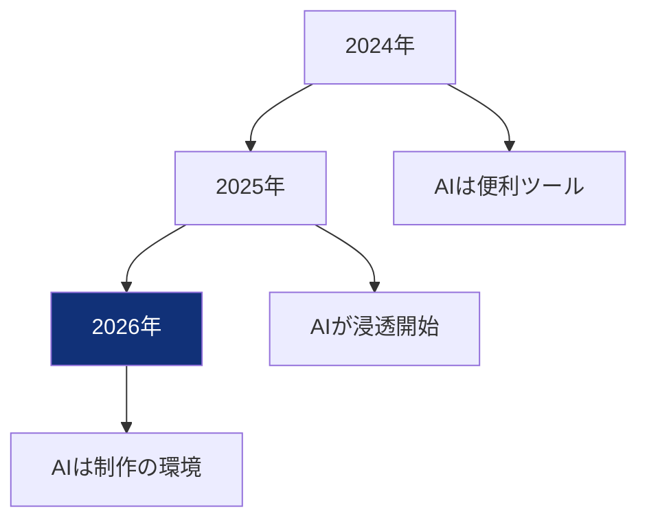
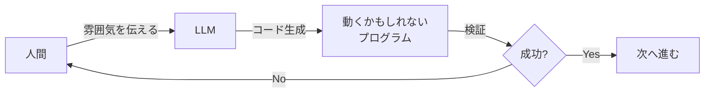
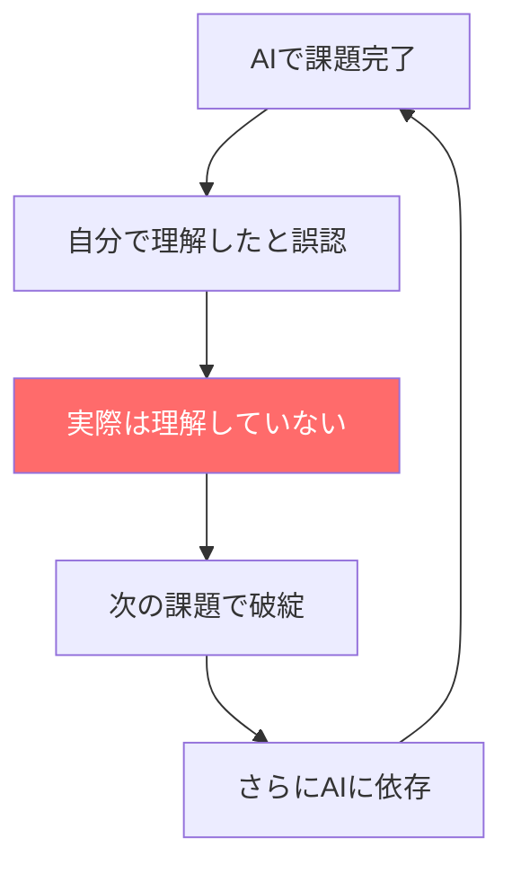
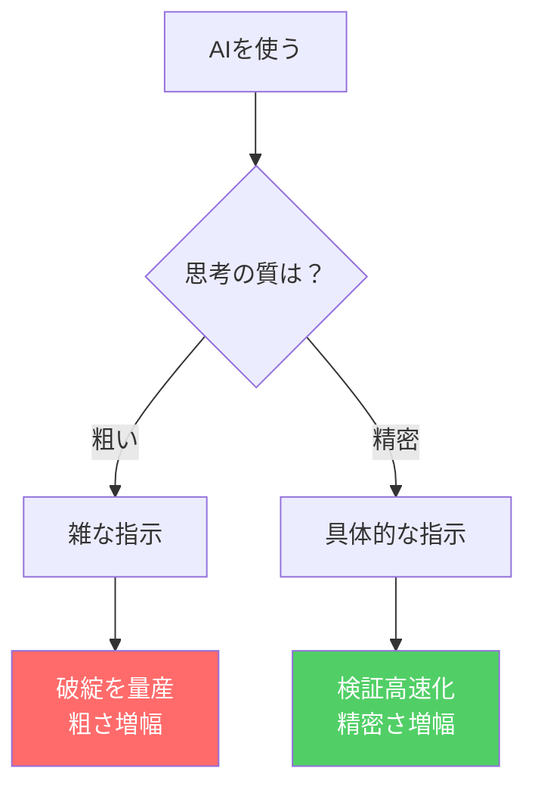

# AI技術の活用（ゲームとAI）2026

## 第1章 導入・問題提起

本講義の概要と、AI時代における人間の役割を整理する

---

## AI技術の活用（ゲームとAI）2026

- 講師：山村康弘（久留米大学）
- 対象：情報社会学部
- 日程：2026年 春学期
- 目的：AIを「使いこなす」ための思考フレームワークを獲得する
- この授業はゲームとAIを題材に「人間の価値」を問い直す

---

## 2025→2026：この1年で何が変わったか

- LLMが浸透：個人→チーム→産業レベルへ
- 2026：AI（LLM）は「便利ツール」から制作の"環境"へ
- GitHub Copilot、ChatGPT、Claudeが当たり前の開発風景に
- 「自然言語で指示すればAIがコードを書く」時代に突入
- でも同時に「それっぽい破綻」を量産する人も増加

---

## バイブコーディング（Vibe Coding）とは何か

- Andrej Karpathy氏らが提唱した新しい開発スタイル
- 自然言語で「雰囲気（Vibe）」を伝えてAIにコードを書かせる
- コードの細部（構文やメモリ管理）を人間が記述しない
- プログラミングの敷居を劇的に下げた
- しかし、確率的トークン予測という本質を忘れてはいけない

---

## Vibe Codingの落とし穴：理解なき進行

- AIの出力は「それっぽい」が混ざる
- 動くことと正しいことは別
- 「なぜ動くか」を説明できないまま先に進む
- エラーが出てもAIに丸投げ→同じ質問を繰り返す無限ループ
- 最終的にプロジェクトが破綻し、原因が追えない状態へ

---

## 能力の錯覚（Illusion of Competence）

- 学習者がAIの助けで課題を達成し、それを自分の能力と誤認する現象
- 実際の理解度と自己評価の間に大きな乖離が生じる
- AIの流暢な応答が学習者の自信を不当に高める
- 結果：コードは書けるが、なぜ動くか説明できない
- 研究エビデンス：Prather et al. (2024) の視線追跡実験

---

## 理解とパフォーマンスのギャップ

- Comprehension-Performance Gap：理解度と成果の乖離
- タスク完了速度は向上するが、コード全体の理解度は向上しない
- 熟練者：知識基盤とAIの提案を照合する「検証モード」
- 初学者：判断基準がなく、AI出力を解読しようとするか全依存
- 将来的にコードをメンテナンスできないエンジニアが量産されるリスク

---

## 今日の結論：AIは能力ではなく増幅器

- 同じAIでも、使う人の思考の質で結果が大きく変わる
- 思考が粗い → 粗さが加速する（破綻を量産）
- 思考が精密 → 精密さが加速する（検証が高速化）
- AIは人の思考の質を増幅する装置
- これが2026の"本質"

---

## 差がつく3つの能力（3層モデル）

**層A：因数分解**
- 何を「部品」に切るか（コード/画像/レベルデザイン/データ/QA）
- 何が不確実で、何が確実か
- AIは"全体設計"が苦手だから、分解できない人ほど丸投げになる

**層B：明確化（記述）**
- 目的：何を良くしたい？
- 仮説：なぜそれが効く？
- 制約：何を守る？（60fps、コスト、世界観、倫理）

**層C：判断（最終責任）**
- 何を採用するか、何を捨てるか、何を守るか
- AIは提案できても責任は負えない
- 判断を放棄した瞬間、人はAIに使われる側になる

---

## AIに使われる人 vs 使いこなす人

| 観点 | AIに使われる人 | AIを使いこなす人 |
|------|---------------|-----------------|
| 目的 | ない/弱い | 明確にある |
| 分解 | できない（丸投げ） | タスクを部品に分ける |
| 指示 | 曖昧 | 具体的・構造的 |
| 評価 | できない | 比較・検証する |
| 編集 | しない（そのまま使う） | 意図を反映させる |
| 結果 | 自己実現が薄い | 自分の作品として残る |

**あなたは、どちらの人間か？**

---

## 本講義のゴール

- AIを「使いこなす」ための思考フレームワークを獲得する
- 3層モデル（因数分解・明確化・判断）を実践的に習得する
- ゲームを題材にAIの限界と可能性を体感する
- 「能力の錯覚」に陥らない学習戦略を身につける
- AI時代に価値を持つ人材像を明確にする

---

## 本講義のロードマップ

- 第1章 導入：AIは増幅器、3層モデル先出し ← **今日**
- 第2章 ゲームとAI：GPU、リアルタイム制約、LLMの限界
- 第3章 ゲームAI基礎：FSM/BT/GOAP/HTN/強化学習
- 第4章 事例研究：Halo 2、F.E.A.R.、Left 4 Dead
- 第5章 生成AI：生成的負債、能力の錯覚の深掘り
- 第6章 Human×AI：3層モデル実践、ワーク
- 第7章 制作工程：QA、産業構造の変化
- 第8章 学び方と進路：サンドイッチ方式、キャリア

---

## ゲームはAI時代の最良の教材である

- ゲームには最初から揃っている：
  - 目的（勝利条件）
  - 制約（ルール、入力、fps、デバイス）
  - 連続判断（毎フレーム、毎試行）
  - 即時フィードバック（面白い/つまらないが即出る）
- だからゲームはAI時代の人間力（分解・記述・判断）を鍛える"実験場"

---

## ゲーム開発：AIの極限試験場

- ゲーム開発はAIにとって最も困難なタスクの一つ
- 状態（State）の連続的な変化を管理する必要
- リアルタイム処理：16ms/フレーム（60fps）
- 物理法則のシミュレーションとの整合性
- 複雑なユーザーインタラクション
- だからこそ、AIの限界が最も見えやすい

---

## ワーク0：あなたはAIをどこで使ってる？

**3分間の自己振り返り**

1. 過去1ヶ月で、AIを使って何をした？
2. その時、AIの出力をそのまま使った？編集した？
3. AIがいなかったら、自分でできた？
4. 「能力の錯覚」に陥っていないか？
5. 自分は「使われる側」か「使いこなす側」か？

周囲と共有してみよう

---

## この章のまとめ

- 2025→2026：AIは「ツール」から「環境」へ
- Vibe Codingの台頭と落とし穴
- 能力の錯覚（Illusion of Competence）に注意
- **AIは能力ではなく増幅器**：思考の質が出力の質を決める
- 3層モデル：因数分解・明確化・判断
- ゲームはAI時代の最良の学習教材

**次回：ゲームとAIの関係 - なぜLLMはゲームが苦手なのか？**
