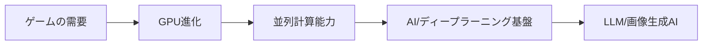
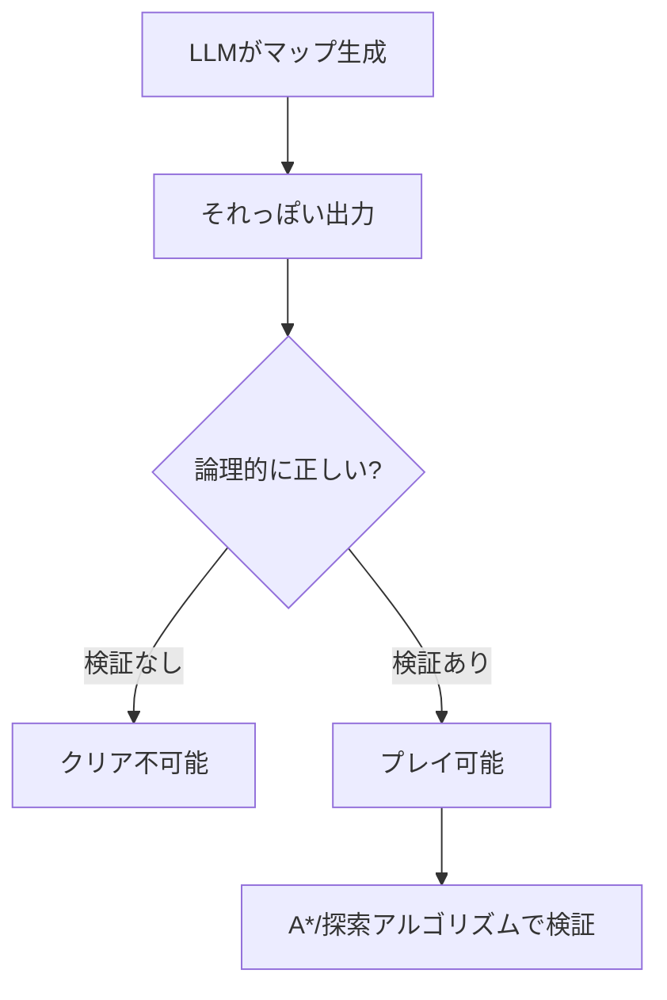
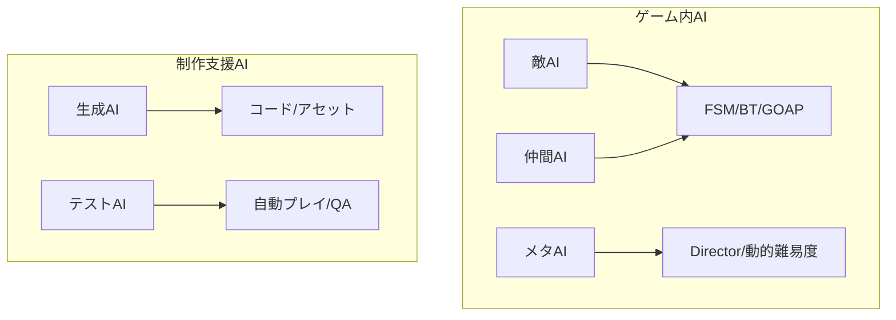
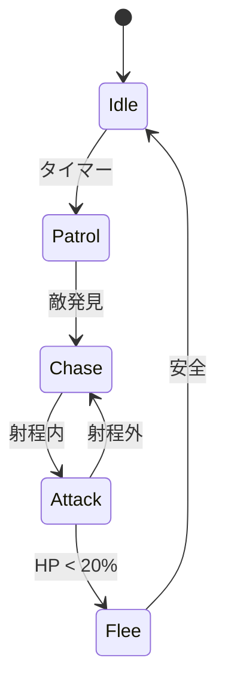
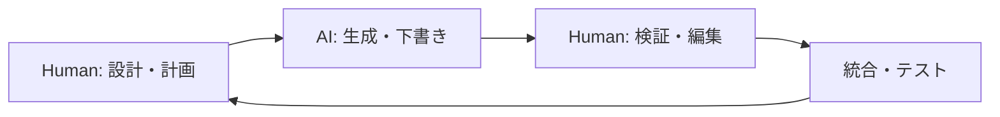

# AI技術の活用（ゲームとAI）2026

<!-- metadata: author=久留米大学, date=2026-01-08 -->

## 第2章 ゲームとAIの関係

ゲームがAI技術を育て、AIがゲームを進化させてきた歴史を整理する

---

## ゲームとAI（章扉）

- 視点：ゲームはAIの"応用"ではなく"加速装置"
- ゲーム産業がGPU、リアルタイム処理、強化学習を育てた
- 逆に、AIがゲームの表現力と体験を拡張してきた
- この相互作用を理解することが、両方を活用する鍵

---

## ゲームにはリアルタイムグラフィックスが必要

- DirectX、OpenGL：ゲームが要求した低レイヤ性能
- 毎秒60フレーム（16.7ms以内）での描画が必須
- 「それっぽい」から「物理的に正確」への進化
- この要求がGPUアーキテクチャを進化させた
- 結果として、AI計算基盤が誕生した

---

## リアルタイムレイトレーシングの意味

- 従来：ラスタライズ（近似的な光表現）
- 現在：レイトレーシング（物理的に正確な光追跡）
- RTX世代でリアルタイム化が実現
- 「見た目のリアリティ」と「計算コスト」のトレードオフ
- ゲームが要求し続けた結果、技術が追いついた

---

## GPUが必要な理由（ゲーム→AIへの橋）

- 大量の行列計算／並列計算が必要
- CPUの逐次処理では間に合わない
- GPUは数千のコアで同時並列処理
- ゲーム用に発展したGPU文化がAI計算を可能にした
- NVIDIA CUDA → ディープラーニング基盤へ

---

## GPU×機械学習（加速の本質）

- ニューラルネットワーク ＝ 行列乗算の塊
- GPUの特性（大量並列処理）と完全に一致
- 2012年 AlexNet：GPU活用で画像認識が飛躍
- 以降、AI研究はGPU前提で設計される
- ゲームがなければ、今のAIブームはなかった

---

## ゲームは"リアルタイム制約"の塊

- **制約①レイテンシ**：ms単位の応答が必須（100ms超えると違和感）
- **制約②決定性**：同条件で同結果（再現性がないとデバッグ不能）
- **制約③コスト**：常時推論は高い（フレームごとにAI呼び出しは非現実的）
- **制約④デバッグ**：原因追跡できる必要（なぜそう動いたか説明できる）
- これらすべてを満たさないとゲームは成立しない

---

## LLMがゲーム実行時に難しい理由（4つの衝突）

- **レイテンシ**：API呼び出し、推論に数百ms〜数秒
- **非決定性**：同じ入力でも毎回異なる出力（温度パラメータ）
- **状態保持の弱さ**：長期的な一貫性が苦手（幻覚問題）
- **保証の困難さ**：性能・安全・公平の担保が難しい
- ゲームの4つの制約と真っ向から衝突する

---

## 状態管理（State Management）の崩壊

- ゲームは「状態」の連続的な変化を扱う
- プレイヤーのHP、所持アイテム、クエスト進行、敵の位置…
- LLMは本質的にステートレス（状態を持たない）
- テキストアドベンチャーの事例：
  - 「鍵を持っていない」と言った数ターン後に突然ドアを開ける
  - 死んだはずのNPCが会話に参加してくる
- 確実な状態管理システム（Game State Machine）が必要

---

## LLMの幻覚とゲームの破綻

- LLMは「それっぽいテキスト」を生成するが、論理を検証しない
- ゲームでは幻覚が即座に破綻として表面化する
- パズルゲームのレベル生成事例：
  - クリア不可能な配置
  - 物理的に到達できないエリア
- 可解性検証はA*やダイクストラ法の知識が必要

---

## Unity/Unrealとの統合難易度

- **APIの幻覚とバージョン不整合**
  - LLMの学習データは過去のもの
  - 廃止された関数や架空のメソッドを自信満々に提案
  - 例：`transform.Move()`（存在しない関数）
- **ブループリントとC++の乖離**
  - AIはこれらを混同する
  - C++のメモリ管理（ポインタ、参照）を誤る
- 公式ドキュメントを読み解く基礎力が不可欠

---

## 物理エンジンの無視

- AIはエンジンの物理法則を無視したコードを生成しがち
- 例：Rigidbodyオブジェクトに対して
  - 物理演算フレーム（FixedUpdate）ではなく
  - 描画フレーム（Update）で直接座標を書き換え
- 結果：「一見動く」が、壁をすり抜けたり挙動が不安定に
- エンジンのライフサイクル理解がなければバグ原因を特定できない

---

## だから「ゲームはAIの限界が見える」

- Webアプリよりシビア（状態・リアルタイム・空間・物理）
- ステートレスな処理では破綻する
- 決定論的な保証が必要な場面が多い
- だからこそ「教材として強い」
- AIの限界を知ることで、正しい使い方が分かる

---

## なぜゲームにAIが必要なのか？

- 代表：敵AI（対戦相手の演出）
- プレイヤーに「手応え」と「学習可能性」を提供
- 単調すぎると飽きる、強すぎると挫折する
- 「ちょうどいい難易度」の実現にAIが必要
- でも今は敵AIだけではない（伏線）

---

## ゲームAIの見取り図（目的で整理）

- **①敵AI**：手応え・学習可能性・プレイヤーの成長促進
- **②仲間AI**：協力・補助・プレイヤーの負担軽減
- **③メタAI**：難易度調整・演出・ペーシング制御
- **④制作支援AI**：生成・テスト・運用・QA
- それぞれに適した技術がある

---

## ゲームAIの哲学：知性の錯覚

- 学術的AI：最適解、人間を超える性能を追求
- ゲームAI：プレイヤーを楽しませる「知性の錯覚」を構築
- 「賢さ」≠ 高度な戦術的計算
- プレイヤーにとって認識可能な行動、意図が伝わる動き
- 適度な「人間らしい失敗」こそがAIを知的に感じさせる

---

## ゲームAIの技術史：複雑性の管理

- 1990年代：有限ステートマシン（FSM）の時代
- 2004年：ビヘイビアツリー（BT）の革命（Halo 2）
- 2005年：GOAP（ゴール指向アクションプランニング）（F.E.A.R.）
- 2010年代：HTN（階層型タスクネットワーク）（Horizon Zero Dawn）
- 2008年〜：AI Director（Left 4 Dead）
- 歴史は「複雑性をどう管理するか」の試行錯誤

---

## FSM（有限ステートマシン）：初期の標準

- エージェントの「状態」と「遷移条件」の集合
- 状態：Idle（待機）, Patrol（巡回）, Attack（攻撃）, Flee（逃走）
- 遷移：If Health < 20% → Fleeへ移行
- 利点：決定論的、デバッグ容易、意図を固定できる
- 問題：**ステート爆発**（状態数Nで遷移がN²のオーダー）

---

## ビヘイビアツリー（BT）：Halo 2の革命

- Bungie（Halo 2開発）がFSMの限界に直面
- 「状態遷移」ではなく「タスクの階層構造」で行動を決定
- **セレクター（OR）**：子ノードを順に試し、成功したら終了
- **シーケンス（AND）**：子ノードを順に実行、全成功で成功
- モジュール性の獲得：行動パターンを独立したサブツリーとして設計
- 「徒歩用」から「ビークル用」へサブツリーを差し替えるだけ

---

## GOAP（ゴール指向アクションプランニング）：F.E.A.R.

- 「どう動くか（How）」ではなく「何をしたいか（What）」を指定
- AIがリアルタイムで計画を立案する
- **ゴール**：KillEnemy（敵を倒す）、Survive（生き残る）
- **アクション**：前提条件、効果、コストを定義
- 創発的挙動の例：「テーブルを倒して遮蔽物にする」
  - デザイナーは「テーブルを見たら倒せ」とは書いていない
  - AIが因果関係を発見して実行した

---

## HTN（階層型タスクネットワーク）：Horizon Zero Dawn

- GOAPの探索空間爆発問題を解決
- 複合タスク：抽象的な目標（例：「プレイヤーを狩る」）
- 基本タスク：実行可能なアクション（例：「移動する」）
- メソッド（方法）で分解：
  - 隠密メソッド：草むらに移動→待ち伏せ→急襲
  - 強襲メソッド：咆哮→突進
- 「The Collective」：群れ全体の役割調整システム

---

## AI Director：Left 4 Dead

- キャラクターAIではなく「メタAI」「システムAI」
- プレイヤーの状態をリアルタイムで監視
- ゲームの「ドラマ」を動的に生成
- **ペーシングサイクル**：静寂→ピーク→緩和
- 高ストレス時：敵スポーン抑制、回復の機会を提供
- 余裕時：特殊感染者を出現させて緊張感を高める
- Structured Unpredictability（構造化された予測不能性）

---

## 熟練者と初学者のAI利用の差

| 行動指標 | 熟練者 | 初学者 |
|---------|-------|-------|
| 視線動向 | 論理構造（ループ、分岐）を注視 | 全体を漠然と見る、コピーボタンを探す |
| デバッグ戦略 | エラーメッセージに基づき特定箇所を修正 | 全文を再生成、「動かない」と曖昧に訴える |
| 認知的負荷 | 減少（単純作業からの解放） | 増大（検証不能なコードへの不安）or著しく低下（思考停止） |
| 成果物の品質 | 高い（保守性・効率性が考慮） | 表面上は動くが、脆弱性や技術的負債を含む |

---

## サンドイッチ方式の実践

- AIを排除するのではなく、人間の工程で挟み込む
- **Human（設計）**：何を作るか、どういう構造にするかは人間が決める
- **AI（生成）**：ボイラープレート、基本関数、API検索はAIに任せる
- **Human（検証）**：AIが書いたコードを一行ずつ読み、修正・統合
- デザインパターン、セキュリティ、パフォーマンスの知識が必須

---

## 重点的に学ぶべき「基礎」の再定義

- **アルゴリズムとデータ構造**：AIの出力が効率的か判断するため
  - 計算量オーダー、List vs Dictionary vs HashSet
- **メモリとハードウェアの理解**：なぜ重いか、なぜクラッシュするか
  - スタックとヒープ、ガベージコレクション
- **デバッグとトラブルシューティング**：エラーログを読む力
  - 仮説検証のサイクルを回す「探偵」のスキル
- **英語**：最新AIモデル、ドキュメント、精度の高いプロンプト

---

## ゲームAIの歴史：なぜ研究者はゲームを選んだか

- ルールが明確：何が許され何が禁止か定義されている
- 観測可能：すべての状態が見える（完全情報）or 一部隠れている（不完全情報）
- 反復可能：同じ条件で何度も試行できる
- チェス、囲碁、Atariゲーム、麻雀…
- 現実世界より「実験しやすい」環境

---

## AIにとっての難しさ ≠ 人間の難しさ

- 状態空間複雑性：取りうる状態の総数
- ゲーム木複雑性：可能な手順の総数
- 囲碁：10^170以上の局面（宇宙の原子数より多い）
- 「探索の爆発」が起きるからAI技術が必要
- 人間が直感的に解ける問題がAIには難しいこともある

---

## 完全情報ゲーム vs 不完全情報ゲーム

- **完全情報**：チェス、囲碁（すべての状態が見える）
- **不完全情報**：ポーカー、麻雀（相手の手札が見えない）
- 不完全情報 ＝ 推論が必要
- 仮説・予測・確率的判断
- 現実世界に近いのは不完全情報

---

## 回収：人間の仕事も"不完全情報下の意思決定"

- 完全な情報が揃うことはない
- 仮説・予測・推論・曖昧な判断の連続
- AI時代ほど、この力が重要になる
- ゲームで鍛えた「判断力」は現実世界でも活きる
- だからゲームは「思考の筋トレ」になる

---

## この章のまとめ

- ゲームがGPU/AI技術を育て、AIがゲームを進化させてきた
- ゲームは「リアルタイム制約」の塊であり、LLMと衝突する
- ゲームAIの歴史は「複雑性の管理」の歴史
- FSM → BT → GOAP → HTN → Director
- 次章：ゲームAIの基礎技術を「部品」として理解する
