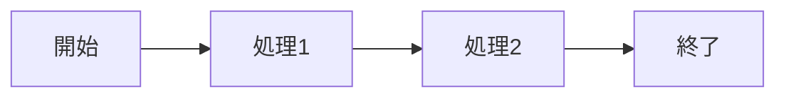

# サンプルプレゼンテーション

<!-- metadata: author=テスト作成者, date=2026-01-08 -->

## はじめに

このスライドはサンプルです。

- 項目1
- 項目2
- 項目3

## Mermaid図の例

以下はフローチャートの例です。

## 2カラムレイアウト

### 左側の内容

- ポイント1
- ポイント2

### 右側の内容

追加の説明テキスト。

## まとめ

- 重要なポイント1
- 重要なポイント2
- 重要なポイント3
